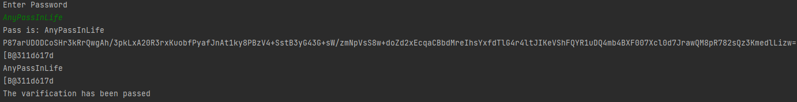

# Report on Laboratory number 4

### Course: Cryptography & Security
### Author: Coșeru Cătălin

----

## A very short explanation
In general, the given laboratory is based on the fact that we take an input from the keyboard, being like a password, apply RSA encoding, then hash it, and enter the hashed value in the database. Then we do the decryption and take the value from the db, making a check if it is equal to the hashed decrypted value.

## Theory
**RSA**\
RSA or Rivest–Shamir–Adleman is an algorithm employed by modern computers to encrypt
and decrypt messages. It is an asymmetric cryptographic algorithm. Asymmetric means
that there are two different keys. This is also called public-key cryptography
because one among the keys are often given to anyone. The other is the private key
which is kept private. The algorithm is predicated on the very fact that finding
the factors of an outsized number is difficult: when the factors are prime numbers,
the matter is named prime factorization. It is also a key pair (public and personal
key) generator.

**SHA**\
The SHA (Secure Hash Algorithm) is one of the popular cryptographic hash functions. A cryptographic hash can be used to make a signature for a text or a data file.
The SHA-256 algorithm generates an almost unique, fixed-size 256-bit (32-byte) hash. This is a one-way function, so the result cannot be decrypted back to the original value.
\
Currently, SHA-2 hashing is widely used, as it is considered the most secure hashing algorithm in the cryptographic arena.
SHA-3 is the latest secure hashing standard after SHA-2. Compared to SHA-2, SHA-3 provides a different approach to generate a unique one-way hash, and it can be much faster on some hardware implementations. Similar to SHA-256, SHA3-256 is the 256-bit fixed-length algorithm in SHA-3.
So I will use SHA-2 with 256-bit hash.

## Objectives:
1. Get familiar with the hashing techniques/algorithms.
2. Use an appropriate hashing algorithms to store passwords in a local DB.
    1. You can use already implemented algortihms from libraries provided for your language.
    2. The DB choise is up to you, but it can be something simple, like an in memory one.
3. Use an asymmetric cipher to implement a digital signature process for a user message.
    1. Take the user input message.
    2. Preprocess the message, if needed.
    3. Get a digest of it via hashing.
    4. Encrypt it with the chosen cipher.
    5. Perform a digital signature check by comparing the hash of the message with the decrypted one.


## Implementation description

###General working
I Begin by making a database , and initialize it.

* **Code of db**
  So , I "wrote my own db" , in fact is just a class with a list named password , where id of pass is the id in the list.
  It's just a simple thing , just to check the working of algorithm.
```
public class DataBase {
    List<String> passwords = new ArrayList<String>();
}
``` 

after this creation I use java.scanner class in order to get the input from User , for pretending 
that I take pass from real users XD.

Soo , after that , I had to initialize RSA , because it was kind of pointless to write and create the keys, I decided to initialize 2 strings with already initialized keys. After that I started a try-catch block to catch all the errors in the program. I encrypted the password taken from the input received from the User.


###RSA

I wrote the main idea of this algorithm in laboratory 3, here I will write what I used, quickly.

* **encription**

```
   String encryptedString = Base64.getEncoder().encodeToString(RSAUtil.encrypt(password, publicKey));
   System.out.println(encryptedString);
```

* **Code of Decryption**
```
String decryptedString = RSAUtil.decrypt(encryptedString, privateKey);
            System.out.println(decryptedString);
```

Also I use Hashing and check Hashing value of raw pass with decripted and hashed one.

###Hashing

I have hashed the pass with SHA function that I wrote in a separate class called named Data.

```
            byte[] check = sha.Sha(password);
            System.out.println(check);
            String s = check.toString();
            db.passwords.add(s);
```

* Sha functions :\
I used library , builtin in java called MessageDigest , so I wrote a very simple function to hashing 
passwords by using this library. 

The code is :
```
    byte[] Sha(String originalString) throws NoSuchAlgorithmException {
        MessageDigest digest = MessageDigest.getInstance("SHA-256");
        byte[] encodedhash = digest.digest(
                originalString.getBytes(StandardCharsets.UTF_8));
        return encodedhash;
    }
```

also I had write a one more method for converting byte to hex sooo...

its the code of it : 
``` 
    private static String bytesToHex(byte[] hash) {
        StringBuilder hexString = new StringBuilder(2 * hash.length);
        for (int i = 0; i < hash.length; i++) {
            String hex = Integer.toHexString(0xff & hash[i]);
            if(hex.length() == 1) {
                hexString.append('0');
            }
            hexString.append(hex);
        }
        return hexString.toString();
    }
```

Soo that's all , I just explain already what I have do after that hashing in my very short explanation.


## Conclusions / Screenshots / Results
It wasn't a very difficult lab, thanks to the use of already written libraries, I liked it that way, it was quite easy to understand, and still I went through several sites to understand how and why we use hashing, I also read from briliant.com how SHA hashing takes place.

So everything works perfectly as you can see in the screen below.

