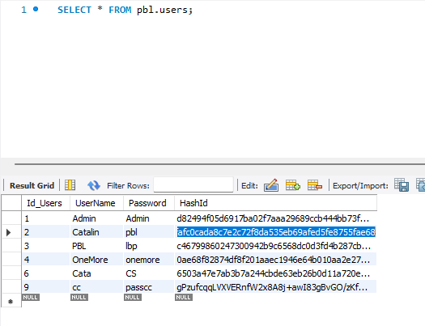
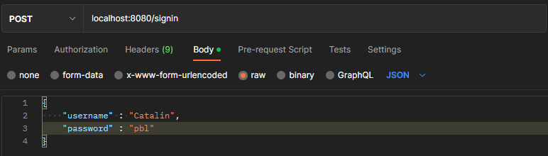
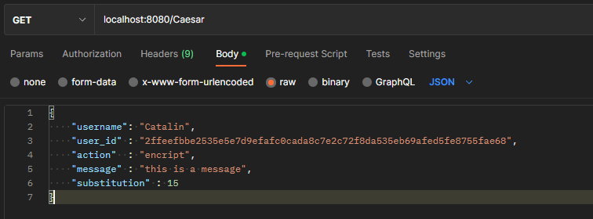
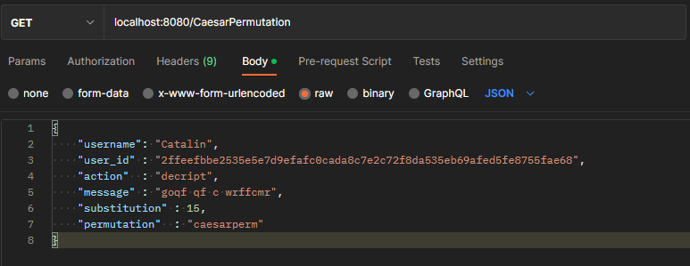

# Report on Laboratory number 

### Course: Cryptography & Security
### Author: Coșeru Cătălin

----

## A very short explanation
In general, laboratory 5 is based more on a theoretical authentication and authorization, and not one that can be used in reality. The SignIn request contains the username and password in the payload (which is a json), and as a response the person receives a token_id. After which, if the access token for encryption and decryption coincides with the hash token from the DB (I use MySQL), the request can be made, otherwise we get an error as a response.
## Theory
**Authentication**\
Basic authentication is an HTTP-based authentication approach and is the simplest way to secure REST APIs. It uses a Base64 format to encode usernames and passwords, both of which are stored in the HTTP header. This is an effective approach to set up various API access credentials when the priority is for an application to remain lightweight and simple. However, this approach doesn't offer out-of-the-box support for multifactor authentication (MFA) or dynamic, user-specific credentials, which would require the use of additional browser-based extensions and authorization tooling.

Thanks to its simplicity, Basic authentication enjoys widespread support across development toolchains, technologies and platforms. One of the key challenges with this authentication scheme, however, is that sensitive credentials often travel between systems unencrypted. Hence, using Secure Sockets Layer (SSL) and Transport Layer Security (TLS) channels is a must when sharing sensitive data between multiple web applications -- especially third-party applications -- because threat actors can intercept traffic moving through unsecured channels and steal credentials.

## Objectives:
1. Take what you have at the moment from previous laboratory works and put it in a web service / serveral web services.
2. Your services should have implemented basic authentication and MFA (the authentication factors of your choice).
3. Your web app needs to simulate user authorization and the way you authorise user is also a choice that needs to be done by you.
4. As services that your application could provide, you could use the classical ciphers. Basically the user would like to get access and use the classical ciphers, but they need to authenticate and be authorized.

## Implementation description

###General working
I Begin by making a mysql database , and initialize it.

* **MySQL**\
    So in my dataBase I have a table called users, with that columns and data :
  


* **Authentication & Authorization**
  My authentication is not based on a secure channel, it's a simple theoretical authentication and authorization, which boils down to a token and the transmission of requests and data in the payload in json format.

###Authentification
**Authentification**\
Authentification takes place by using a username and a pass. the request having the following form:

as a response, we get a hash value of the input token (if the username and pass coincide with those in the db.) The token is given upon registration and is kept in the DB, so its creation takes place in SignUp. 
The servlet, that is, the function that takes place in the case of receiving a request post at the enpoint /signin is very simple, a query is made in the db, to obtain the data about the user with the given username. 
In the code, everything is not very safe because I have no protection against sql injection , or man in the middle attack. 
And if everything is verified, and the user is authenticated, then a json with user_id (as a token of the open session) is sent as a response.

###Hash_ID in other words Tokens_Authorization
Tokens are generated when a new user is created, and are generated in the following way:
The username and password are taken, then their value is hashed with SHA-256. The received hash is registered in the DB, and is taken as the authorization_token, in the case of authentication.

The code is :
```
    String originalString = username+pass;
		MessageDigest digest = MessageDigest.getInstance("SHA-256");
		byte[] encodedhash = digest.digest(
				originalString.getBytes(StandardCharsets.UTF_8));
		String s_encodedhash = Base64.getEncoder().encodeToString(encodedhash);
		System.out.println(s_encodedhash);
		WriteDB(username , pass, s_encodedhash);
```

###Authorization 
The authorization in the given case consists in the control of the input data of the request. Thus, the username and the authorization token are taken, in case they coincide, the authorization takes place in the application, for the use of encryption methods with classic digits such as Caesar, Vigenere and Playfair.
    

Thus in the request we have username, user_id (which is token_authorization), and already the necessary action such as encrypt / decrypt etc.


###Methods and Endpoints
Each endpoint consists of creating a dictionary, from the payload of the request. After that, a search takes place in the DB, through which we obtain all the data about a certain user, thus we need the username, also for authorization, in the payload dictionary, we have a user_id, as I said before, this is a token_id of authorization received upon authentication. We also have an action that must be performed, in other words encryption or decryption. Next comes the message to be encrypted/decrypted and, of course, the substitution or permutation data used in encoding and decoding.



## Conclusions / Screenshots / Results
It wasn't a very difficult lab, thanks to the use of already written libraries like Spring and the classes what I already write like classicalCiphers, I liked it that way, it was quite easy to understand.
So everything works perfectly as you can see in my web directory.
